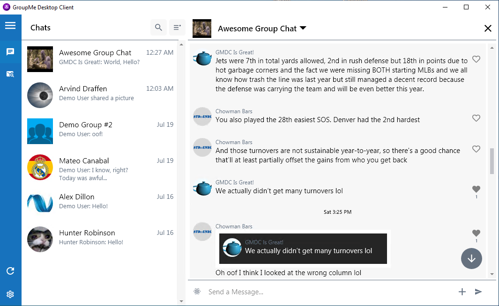
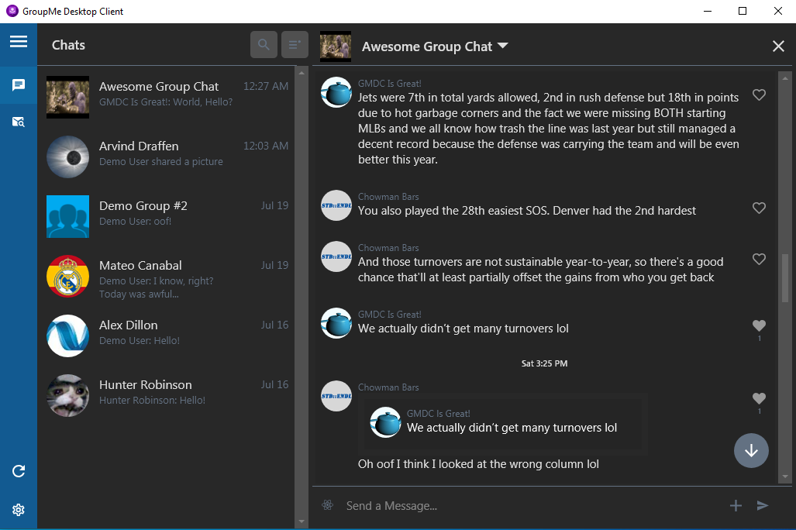
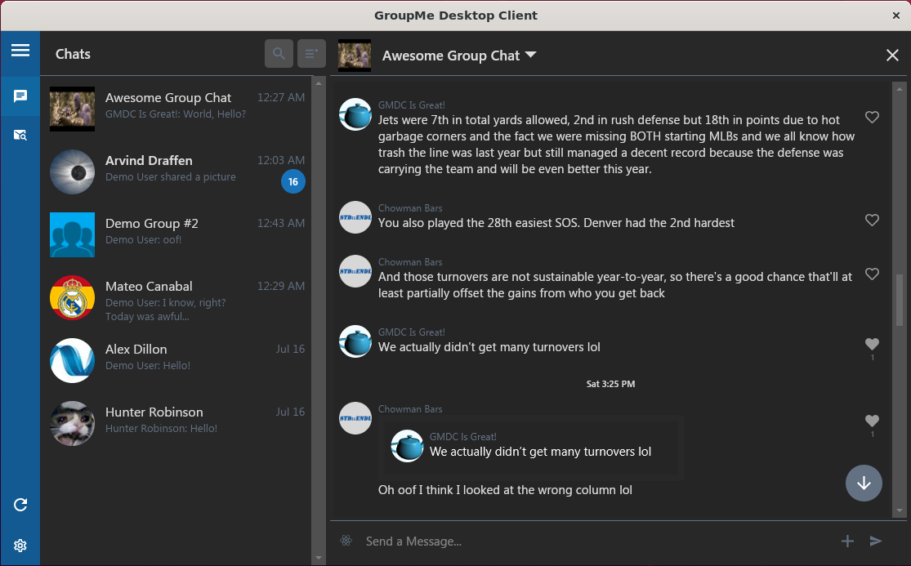
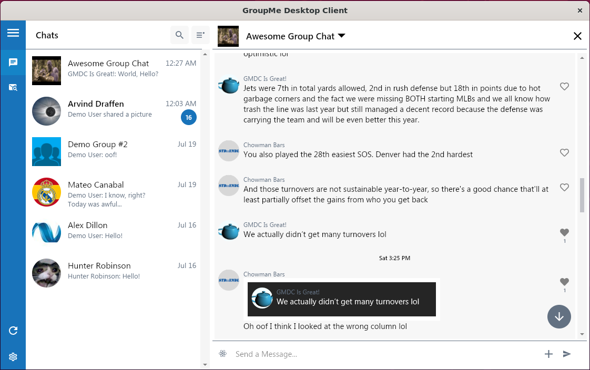
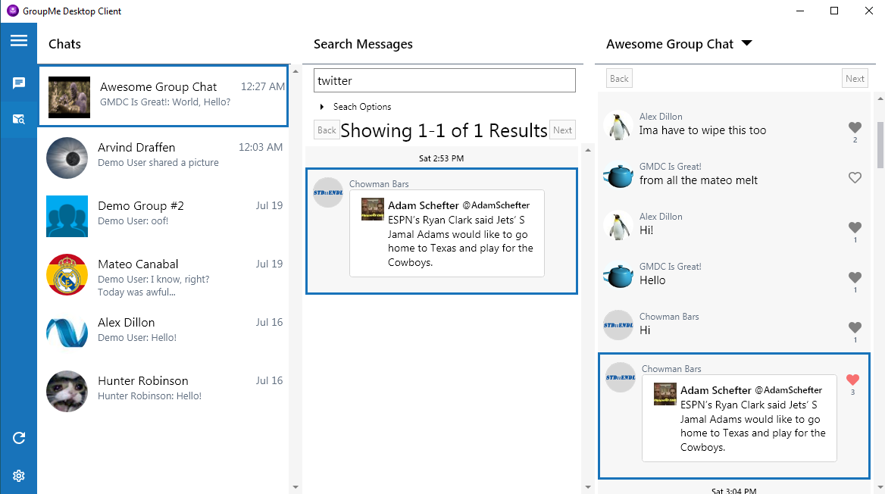
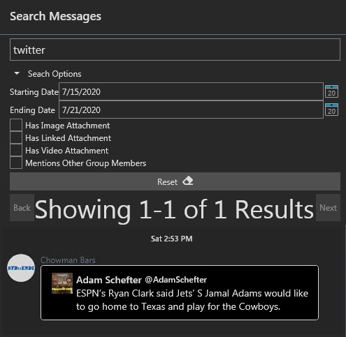
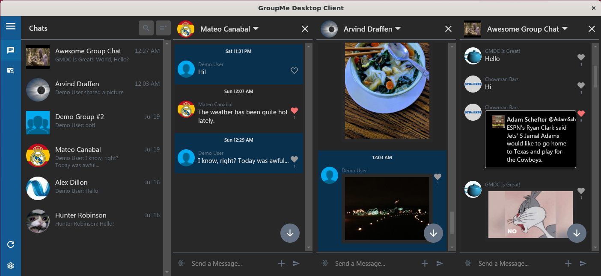
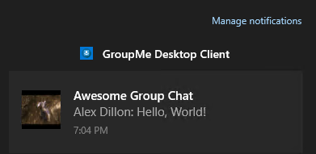

<h1 align="center">GroupMe Desktop Client Avalonia</h1>

<p align="center">
   
</p>

<h2 align="center">
As of August 2020, development on GroupMe Desktop Client Avalonia has moved!
</h2>
<h2 align="center">
Development with the Avalonia UI is now in a branch on the main <a href="https://github.com/alexdillon/GroupMeClient">GMDC Repo</a>. 
</h2>

[DEPRECATED]
GroupMe Desktop Client Avalonia is an in-progress port of [GroupMe Desktop Client](https://github.com/alexdillon/GroupMeClient) to the cross-platform [Avalonia](https://github.com/avaloniaui/avalonia) UI Framework. GroupMe Desktop Client Avalonia is a unofficial, modular, open-source, configurable client for using the GroupMe chat service. 

***For usage on Windows, check out [GroupMe Desktop Client](https://github.com/alexdillon/GroupMeClient), which is stable and suitable for daily use.***

Different color theme options are also supported in GMDCA.

Light Theme (Windows 10)              |  Dark Theme (Windows 10)
:-------------------------:|:-------------------------:
  |  

Dark Theme (Ubuntu 20.04)              |  Light Theme (Ubuntu 20.04)
:-------------------------:|:-------------------------:
  |  

## Features
### Search
GroupMe Desktop Client Avalonia offers offline searching functionality. Messages are  downloaded and indexed, allowing for a variety of search filters and speedy performance.  
 
<table>
  <tr>
    <td>
    
    </td>
    <td>
    
    </td>
  </tr>
</table>

### Multi-Chat
GroupMe Desktop Client Avalonia supports displaying multiple chats simultaneously, side-by-side. The number of chats that can be opened both normally, and in collapsed-sidebar mode is fully user configurable. 



### Full Windows 10 Notification Support
GroupMe Desktop Client Avalonia includes tight integration with Windows 10's Notification system. 




 ## Development Information
 ### General Information
 GMDCA is built using C#/Avalonia running on .NET Core 3.1. All external dependencies are included as NuGet packages, and included projects, so no special steps are required to build a copy of GMDCA using Visual Studio. 
 
 ### Windows
 Visual Studio 2019 is recommended, with the .NET Core 3.1 SDK installed. No additional steps are required, just clone the repository and run a Build from within Visual Studio.


### Ubuntu
GMDCA can also be compiled on Linux using the dotnet CLI.

 - Install .NET Core 3.1 SDK. Directions are available from Microsoft [here](https://docs.microsoft.com/en-us/dotnet/core/install/linux-ubuntu).
 - Clone the repository and begin a build with the commands: 
```bash
git clone https://github.com/alexdillon/GroupMeClientAvalonia/
cd GroupMeClientAvalonia/
dotnet publish GroupMeClientAvalonia -r linux-x64 --self-contained true
```

The resulting binary will be stored in the `GroupMeClientAvalonia\GroupMeClientAvalonia\bin\Debug\netcoreapp3.1\linux-x64\` folder, with the binary named `GroupMeClientAvalonia`. It can be ran from either the terminal, or by double-clicking the executable from the GUI.

### macOS
GMDCA is also compatible with macOS, and has been tested on Catalina with Visual Studio 2019 for Mac.

 ## See Also
 [GroupMeClientApi](https://github.com/alexdillon/GroupMeClientApi) is a custom C# Library created specifically for GroupMe Desktop Client in order to interact with the GroupMe API. While it was created for use with GMDC, it is fully open-source and usable for a variety of applications!

[GroupMeClient](https://github.com/alexdillon/GroupMeClient) is the stable, daily-use-ready GroupMe Client on which GroupMe Desktop Client Avalonia is based. GMDC is feature rich, compatible with most versions of Windows, and actively updated.